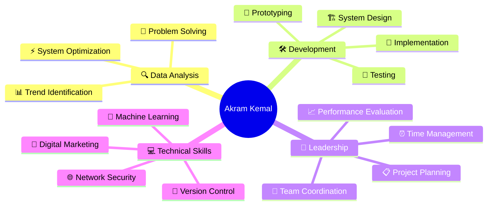

# Hi there! 👋 I'm Akram Kemal Dewantara

  

  
  
  

---

## 🚀 About Me

I'm a passionate **Computer Engineering** graduate with a strong foundation in **Machine Learning**, **System Development**, and **Data Analysis**. I love building innovative solutions from concept to implementation, specializing in educational technology and intelligent systems.

- 🔭 Currently working as **Junior Facilitator** at Kaizen Room, PT CIPTA MANUSIA INDONESIA
- 🌱 Exploring advanced **Machine Learning** algorithms and **Neural Networks**
- 💡 Passionate about creating **accessible digital education products**
- 🎯 Goal: Contributing to impactful tech solutions that make a difference
- 📫 Reach me at: **akramsan642@gmail.com**

---

## 🛠️ Tech Stack & Skills

### Programming Languages

  

### Machine Learning & Data Science

  
  
  
  
  

### Development Tools & Systems

  

### Networking & Security

  
  
  

---

## 🏆 Featured Projects

### 🎤 [Kaizen Speaking App](https://github.com/username/kaizen-speaking-app)
**Machine Learning Speech Analysis System**
- 🤖 Developed ML-based speech training system at Bangkit Academy
- 📊 Provides detailed feedback on clarity, expression, and user progress
- 🎯 Technologies: Python, TensorFlow, Speech Recognition APIs

### 🚂 [IoT Railway Door System](https://github.com/username/iot-railway-door)
**Smart Railway Automation System**
- 🔧 Designed and implemented automated railway barrier system
- 📡 Integrated IoT sensors and hardware components
- ⚡ Built with embedded programming and sensor technologies

### 📊 [Twitter Sentiment Analysis - Indonesian Presidential Election 2024](https://github.com/username/twitter-sentiment-pilpres)
**Undergraduate Thesis Project**
- 🐦 Analyzed Twitter sentiment for Indonesian Presidential Election 2024
- 🧠 Implemented Naive Bayes algorithm with undersampling technique
- 📈 Addressed class imbalance issues in sentiment classification

---

## 📊 GitHub Analytics

  
  

  

---

## 🏅 Certifications & Achievements

  
| Certificate | Year | Issuer |
|-------------|------|--------|
| 🤖 DCML (Dev Certification Machine Learning) | 2025 | Development Community |
| 📱 BNSP Digital Marketing | 2025 | BNSP |
| 🚀 Bangkit Academy Machine Learning Path | 2024 | Google-Tokopedia-Gojek-Traveloka |
| 🔒 CISCO Network Security | 2023 | Cisco |
| 🌐 CISCO CCNA v7 | 2022 | Cisco |
| 💻 CISCO IT Essentials 7 | 2021 | Cisco |

---

## 📈 Professional Experience

### 🎯 **Junior Facilitator** | Kaizen Room, PT CIPTA MANUSIA INDONESIA
*2025 - Present*
- 📚 Develop accessible digital education products
- 🎥 Create and manage digital content (articles, videos, visuals)
- 🎪 Organize public events to enhance educational understanding
- 📊 Monitor and analyze digital product performance

### ⚙️ **Management System** | Hebitfood Jogja
*2024*
- 🚚 Optimized delivery management systems for efficient order distribution
- 📝 Maintained digital records using internal tracking tools
- 🔄 Developed Standard Operating Procedures (SOPs)
- 📊 Analyzed delivery data to identify bottlenecks and suggest optimizations

---

## 🌟 Core Competencies

  

---

## 🎯 Current Focus

  
  
  

---

## 🤝 Let's Connect!

  
  
  

---

  

---

### 💡 Fun Facts
- 🌱 Led environmental conservation initiatives, coordinating 100+ mangrove tree plantings
- ⚽ Former Head of Futsal Club, managing 30+ members and weekly tournaments
- 🎮 Started my tech journey at an internet cafe, learning hardware maintenance and customer service
- 📚 Published research on "Decision Optimization with Neural Networks"

  <i>⭐ If you find my work interesting, don't forget to star my repositories! ⭐</i>

